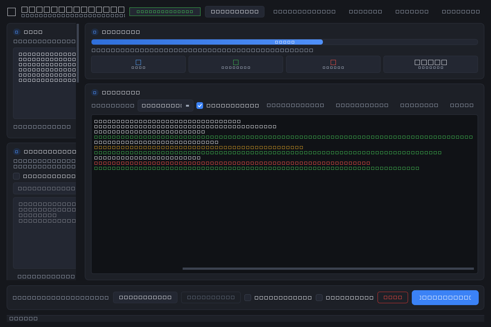
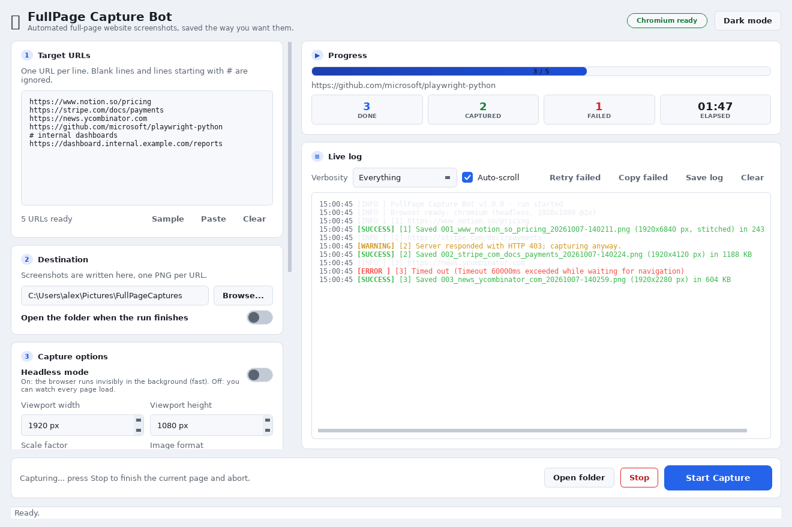

# FullPage Capture Bot

> A professional Windows desktop application that takes **automated, full-page,
> high-quality screenshots** of a list of URLs and saves them systematically.




Built with **PyQt6** (dark, Fluent-inspired theme) and **Playwright** for the
browser automation. The capture pipeline is fully decoupled from the GUI, so it
is exhaustively unit-tested without a browser or a display.

---

## How the pieces talk to each other (a kitchen analogy)

Imagine a busy restaurant kitchen:

* The **waiter** (`app/ui/main_window.py`) takes your order (URLs + settings).
  They never cook; they just write the ticket and hand it over, then keep
  smiling at the table (the UI stays responsive).
* The **expediter** (`app/worker.py`) is the pass between the dining room and the
  kitchen. They carry tickets *in* and shout updates *out* ("table 3's soup is
  up!") - in code, these are **Qt signals**, delivered safely across threads.
* The **chef** (`app/core/engine.py`) does the actual work - opens each page,
  waits for it to finish cooking (network idle + lazy content), and plates it
  (writes the PNG). The chef never talks to customers directly.
* The **recipe card** (`app/core/settings.py`) is a plain, validated description
  of *what* to cook, so the same recipe can be read by the UI, the tests, or a
  future command-line front end.
* The **stove** is Playwright/Chromium - swappable and, in tests, replaced by a
  fake so the chef's technique can be checked without fire.

If any dish fails (a page errors), the chef notes it and moves to the next - the
kitchen never catches fire (the app never crashes).

---

## Features

- **Click through the site**: a journey (a written click-path, TOML or one line per
  step in the UI) walks the pages and saves a separate full-page screenshot of every
  screen - including the ones behind a Sign-in button, a Filters panel or a tab.
- **Crawl mode**: point it at one URL and it finds the buttons/tabs/links itself,
  clicks them, and photographs every screen it reaches - with depth/state/time
  budgets and a skip-list for destructive buttons ("Delete account", "Buy now").
- **Record a session**: click through the site once in a real browser and the steps
  write themselves - scrolls and the pauses that let a lazy list load included -
  plus six **recipes** (shop, login-dashboard, tabs, wizard, sso-login, pricing)
  for when you would rather start from an example. Edit the steps as **rows**
  (optional / timeout / alternative selector per step) and save your own recipes
  into `~/.capture-bot/recipes/*.txt` for the whole team to pick.
- **Screens report**: one page per walk - every screen, the clicks that led to it,
  its thumbnail, what was skipped and why; `crawl --compare` adds what is new, gone,
  renamed or **changed** (compared by their pixels, shown before/after, with
  `--fail-on-change` for a cron job).
- **One sign-in, many hosts**: a click-path may `goto` another domain, and journeys
  with `share_session = true` (or `journey --share-session`) ride in one browser
  session - the SSO provider's cookie is still there on the app's host, and the
  session can be saved so the next run starts signed in.
- Paste **multiple URLs** (one per line), with blank lines / `#` comments ignored.
- **Browse** for the destination folder, with an *open when finished* toggle.
- **Headless mode** toggle (real sliding switch) to show or hide the browser.
- Optional **Username / Password** login - HTML form auto-fill *or* HTTP basic auth.
- **Retina-quality** capture: configurable viewport + device-scale factor.
- Smart loading: waits for DOM + network-idle, then **scrolls to trigger lazy media**.
- **Very tall pages** are captured in segments and **stitched** (Pillow).
- Per-URL **retries**, *stop on first error*, and graceful error containment.
- **Live log console** with level filtering, colours, save-to-file, auto-scroll.
- **Progress dashboard** (done / captured / failed / elapsed) and a progress bar.
- **Retry failed** and **copy failed** one-click recovery.
- **Dark & light themes** with a one-click switch (persisted).
- **CSV + JSON results report** written next to the screenshots.
- **Scheduling**: auto-repeat every N minutes *or* a fixed daily time.
- **Profiles**: save/apply/delete named per-project setups (settings + URL list).
- **Change alerts**: fire a webhook (generic JSON, Slack or Teams) or email when a monitored page changes.
- **Secrets stay in the keychain**: the SMTP password is kept in Windows Credential Locker / macOS Keychain / a Linux Secret Service (`secrets set|show|forget`), not in the settings file the whole team can read.
- **Quiet hours**: hold alerts inside one or more windows (`22:00-07:00, fri18:00-mon09:00`) and send the held night or weekend as one message afterwards.
- **Muted sites**: `alert_mute_urls` (CLI `--mute-urls`, UI field) keeps staging hosts and previews from ever paging anyone.
- **Per-profile digests**: each saved profile keeps its own digest window and tracking issue, so one machine can run a daily digest for one client and a monthly one for another.
- **Weekly digest**: a plain-text summary of recent activity (changes, failures, busiest sites, stale baselines), printable or emailed on a schedule - with the dashboard, CSV, drift chart PNG or the trend PDF attached (`--attach dashboard,csv,drift,pdf`).
- **Drift history**: every run records how far a pinned site has moved, so the dashboard charts the drift over time.
- **Pinned baselines**: mark a known-good capture per site; diffs are then measured against it, not against the previous run - with a drift bar in the dashboard, a staleness warning, and an optional 'drift alert' that pages when a capture moves too far from it.
- **Disk housekeeping**: retention windows delete old screenshots (by age *or* by a folder size cap) and prune the SQLite index automatically, the history itself can be capped by size (`history_retention_mb`), all with `--dry-run` to preview first and `history --reindex` to rebuild the index from the reports.
- **History API**: `serve` exposes the history as read-only JSON/HTML over HTTP (paginated `/api/history`, downloadable `/api/export` with `ETag`/`304` revalidation), with TLS (`--tls-cert/--tls-key`), an optional bearer token (`--token`), a public-dashboard scope (`--public-dashboard`), per-client rate limiting (`--rate-limit N`), CORS (`--cors`), a self-describing `/api/schema` and a `/api/status` health probe (totals, index size, queued alerts, quiet-hours state and a fresh/stale verdict).
- **PDF report**: export the last run (stats + thumbnails) to a PDF, optionally changes-only.
- **Proxy & session**: route through a proxy and inject a saved `storage_state` (cookies).
- **History dashboard**: a per-site capture/change timeline built from the report files.
- **Change-trend chart**: a per-site diff-over-time graph, opened from History.
- **Trend report**: a per-site change summary is logged after every (scheduled) run.
- **SQLite history index**: every run is indexed in `history.sqlite3`, so trend queries stay fast as the number of reports grows.
- **Alert threshold**: only page someone when a change is big enough - webhook/SMTP fire automatically, small changes stay quiet.
- **Web dashboard**: export a self-contained HTML trend dashboard (per-site table + inline SVG sparklines + a search box, or one site via `?url=`/`--url`), no server needed - plus a daily GitHub Actions workflow that publishes it to GitHub Pages.
- **CI**: matrix unit tests + a real-browser end-to-end job + a coverage gate (88%), and tag-triggered Release automation that builds the `.exe`.
- **Smart retries**: exponential backoff between failed attempts, with the reason logged each time.
- **Browser watchdog**: detects a lost browser connection and relaunches it mid-run (sequential and parallel).
- **Bilingual UI**: English / Persian (فارسی) with automatic RTL, switchable at runtime.
- **Durable queue**: an interrupted batch is restored on the next launch.
- **Before/after viewer**: side-by-side captures with a highlighted pixel difference, opened from History.
- **Politeness & robots**: a configurable inter-request delay and optional robots.txt respect.
- **Desktop notifications**: an OS notification when a run finishes.
- **Compressed output**: PNG/JPEG/WebP/AVIF with quality control (AVIF falls back to PNG when the codec is missing).
- **Page diagnostics**: console errors, page exceptions and failed requests captured per URL (log + report).
- **HAR recording**: optional per-URL network log for debugging.
- **Per-host throttling**: cap simultaneous captures per host in parallel mode.
- **Appearance**: extra themes (dark/light/midnight/high-contrast) and a custom UI font.
- **Priority queue**: run higher-priority URLs first (sequential and parallel).
- **Cron scheduling**: standard 5-field cron expressions in addition to interval/daily.
- **Parallel capture**: up to 8 worker browsers capture pages concurrently
  (each worker owns its own browser), with results re-sorted into URL order.
- **Visual change monitoring**: each capture is compared to the previous one
  (dHash); a new file is saved only when the change crosses the threshold, so
  you can watch a site for meaningful changes without flooding the folder.
- Settings are **persisted** between runs (password is never stored).
- Friendly **browser status** chip + in-app **"Install browser"** downloader.
- **CI** runs the whole suite headlessly on every push / PR (Linux + Windows).
- **Headless CLI** (`python -m app.cli`) with `capture` / `schedule` / `history` subcommands, reusing the same engine for CI/automation.
- **Auto-update check** against GitHub Releases, plus an optional **code-signing** script for Windows.

## Project layout

```
main.py                    Entry point (also what PyInstaller wraps)
app/
  version.py               Name / version
  worker.py                QThread bridge (Qt signals only)
  cli.py                   Headless command-line front end (no Qt)
  core/                    Qt-free automation
    engine.py              Playwright capture pipeline
    settings.py            CaptureSettings dataclass + validation
    url_utils.py           URL parsing / validation / file naming
    runtime.py             Browser discovery + installer
    schedule.py            daily/interval scheduling math
    profiles.py            named config profiles (JSON)
    alerts.py              change alerts (webhook + SMTP email)
    secrets.py             the SMTP password, in the OS keychain instead of a file
    pdfreport.py           PDF report builder (Pillow)
    history.py             per-site change timeline from reports
    journey.py             click-paths: a written tour, photographed screen by screen
    crawler.py             the curious visitor: finds the buttons and clicks them
  ui/                      PyQt6 interface
    theme.py               Dark Fluent palette + QSS
    widgets.py             ToggleSwitch, Card, StatChip, LogConsole, ...
    main_window.py         The main window
tests/                     120+ tests (no real browser or display needed)
FullPageCaptureBot.spec    PyInstaller single-file build
build_windows_exe.bat      One-click Windows build
docs/PACKAGING.md          Exact .exe packaging steps
tools/make_icon.py         Regenerates assets/icon.{png,ico}
tools/render_ui_preview.py Regenerates docs/ui-preview.png
```

## Run it (development)

```bash
python -m venv .venv && source .venv/bin/activate      # Windows: .venv\Scripts\activate
pip install -r requirements.txt
python -m playwright install chromium
python main.py
```

## Publish the dashboard

Commit the JSON reports (no screenshots needed) into `dashboard_data/`, enable
GitHub Pages (Settings -> Pages -> Source: GitHub Actions), and the
`Trend dashboard` workflow will rebuild and publish the dashboard daily, or on
demand:

```bash
gh workflow run "Trend dashboard" -f history_dir=dashboard_data -f baseline_max_age=30
```

Pull requests get a **temporary preview**: the workflow builds the dashboard,
uploads it as a 14-day artifact and comments the link on the PR. The weekly
digest has its own workflow - set the `CAPTURE_SMTP_*` / `CAPTURE_DIGEST_TO`
secrets and it emails every Monday (or run `gh workflow run "Weekly digest"`). The
PR comment also shows a **base branch vs this branch** comparison computed from
both histories (`digest --dir pr/dashboard_data --base base/dashboard_data`).
The comment is *sticky*: each run updates the same comment instead of adding
another one. The weekly digest can do the same on a tracking issue - set the
`DIGEST_ISSUE_NUMBER` secret (or pass `issue_number`) and the summary is
posted/updated there, with no email configuration needed. Pass
`profiles_base` to the workflow and each profile's own window/issue is used
instead (`digest --profiles` + `tools/post_digest.py`).

The digest email is sent with the current dashboard attached (use `--attach csv`
for a CSV of the rows, or `--attach none`); `--max-attachment-kb N` drops the
attachment when the history grows past a size limit, and the body says so. The
digest also lists the **top drift vs pinned baseline** sites, and
`--link-base http://host:8765` replaces a heavy attachment with links into a
running `serve` instance.

## Test it

```bash
pip install -r requirements-dev.txt   # runtime + test + lint tooling
python -m pytest                       # offline suite (no browser needed)
python -m pytest --cov=app --cov-report=term-missing   # with coverage
ruff check .                           # lint (also enforced in CI)
```

Lint/format tooling (ruff + black) is configured in `pyproject.toml`; run
`pre-commit install` once to apply the git hooks. A per-test timeout
(`pytest-timeout`) keeps the suite from ever hanging. CI runs the lint job, the
unit suite, and a real-browser end-to-end job with a coverage gate.

## Headless CLI (for CI / automation)

The same engine is exposed as a CLI, no GUI or display needed:

```bash
python -m app.cli https://a.com https://b.com --out ./shots --concurrency 4
python -m app.cli --urls-file list.txt --out ./shots --change-detection --json
python -m app.cli history --dir ./shots --trend          # per-site trend report
python -m app.cli dashboard --dir ./shots --out dashboard.html
python -m app.cli baseline --dir ./shots --pin https://a.com   # pin a known-good baseline
python -m app.cli baseline --dir ./shots --list                # which sites are pinned
python -m app.cli digest --dir ./shots --days 7                # weekly summary (prints)
python -m app.cli digest --dir ./shots --days 7 --send         # ... emailed over SMTP
python -m app.cli digest --dir ./shots --attach csv,drift,pdf \
    --send --smtp-host smtp.example.com --email-to ops@x.com    # CSV + chart + PDF
python -m app.cli history --dir ./shots --prune-screenshots 30 # disk housekeeping
python -m app.cli history --dir ./shots --export csv --out history.csv   # offline export
python -m app.cli history --dir ./shots --prune-screenshots-mb 500      # keep the folder small
python -m app.cli history --dir ./shots --prune-history-mb 50            # keep the history small
python -m app.cli history --dir ./shots --vacuum               # compact the index
python -m app.cli history --dir ./shots --reindex              # rebuild it from the reports
python -m app.cli history --dir ./shots --verify               # does the index still match the reports?
python -m app.cli history --dir ./shots --verify --json        # same verdict, ready for CI
python -m app.cli history --dir ./shots --top-space --limit 5   # the hosts that cost the most disk
python -m app.cli history --dir ./shots --prune-site news.example.com --dry-run
python -m app.cli dashboard --dir ./shots --url a.com          # one site only
python -m app.cli https://a.com --out ./shots --change-detection \
    --quiet-hours "22:00-07:00, fri18:00-mon09:00" --mute-urls staging,preview
python -m app.cli https://a.com --out ./shots --watchdog-max-age 90     # alarm if nothing lands
python -m app.cli digest --profiles                      # one digest per saved profile
python -m app.cli serve --dir ./shots --port 8765               # JSON/HTML history API
python -m app.cli serve --dir ./shots --token s3cret --cors     # token + browser access
python -m app.cli serve --dir ./shots --tls-cert cert.pem \
    --tls-key key.pem --token s3cret                            # HTTPS for the token
python -m app.cli serve --dir ./shots --token s3cret \
    --public-dashboard --rate-limit 60                          # wall display + throttling
python -m app.cli serve --dir ./shots --stale-after 90          # /api/status judges freshness
python -m app.cli metrics --dir ./shots --stale-after 90        # Prometheus text for a monitor
python -m app.cli dashboard --dir ./shots --caps 500,50         # show the caps the bot runs with
python -m app.cli digest --dir ./shots --send --skip-if-unchanged   # stay quiet if nothing new
python -m app.cli https://a.com --out ./shots \
    --quiet-urls "staging.example.com=fri18:00-mon09:00; news.example.com="
curl -H "Authorization: Bearer s3cret" \
     "http://host:8765/api/export?format=csv&url=a.com" > history.csv
curl -s "http://host:8765/api/status?quiet_hours=22:00-07:00" | jq .pending_alerts
curl -sI -H 'If-None-Match: "abc123"' http://host:8765/api/export   # 304 when nothing changed
curl -s http://host:8765/metrics | grep capture_bot_last_capture_age_seconds
curl -s "http://host:8765/api/storage?format=csv&history_mb=50" | column -t -s,
python -m app.cli metrics --dir ./shots --out /var/lib/node_exporter/textfile/capture_bot.prom \
    --write-if-changed                                          # for the timer in deploy/
python -m app.cli history --dir ./shots --prune-history-mb 50 --archive   # zip, don't delete
python -m app.cli history --dir ./shots --archive --older-than 90         # archive by age
python -m app.cli history --dir ./shots --restore archive-2026-01.zip     # bring a month back
python -m app.cli dashboard --dir ./shots --caps 500,50 \
    --storage-json storage.json                                 # one file per machine
    --storage-series 14                                         # and the last 14 samples
python -m app.cli https://a.com --out ./shots \
    --route-urls "staging.example.com=https://hooks.example.com/staging; *=https://hooks.example.com/all"
```

Exit codes for CI: `0` all captured, `1` some failed, `2` bad config, `3` browser not installed.

On a machine **without a display** (CI/Linux), the suite forces Qt's
`offscreen` platform automatically (`tests/conftest.py`). On a minimal Linux
container you must also provide Qt's native libraries (e.g. `libGL`); a tiny
throwaway shim is enough for headless testing, but on Windows/macOS nothing
extra is needed.

### Quiet hours, exports and the search box

- `alert_quiet_hours` (CLI `--quiet-hours`, env `CAPTURE_QUIET_HOURS`) takes a
  window such as `22:00-07:00` (it wraps past midnight). Alerts raised inside it
  are written to `pending-alerts.json` next to the history and sent as a single
  message by the first run after the window - one entry per site, newest state
  wins, so a noisy night becomes one morning notification.
- `/api/export?format=csv|json&url=&limit=&offset=` downloads the history (the
  CSV carries `timestamp,url,label,status,diff,drift,file`). `/?url=` serves the
  dashboard for one site only.
- The HTML dashboard ships a search box (a few lines of inline JavaScript, no
  network assets) that filters the table as you type and shows `3 of 12 sites`.

### Exporting, disk caps, the status probe and muted sites

- `history --dir DIR --export csv|json [--out FILE] [--url TEXT] [--limit N]
  [--offset N]` writes exactly what `/api/export` would return (same envelope,
  same CSV columns) - to a file, or to stdout when `--out` is omitted.
- `screenshot_retention_mb` (CLI `history --prune-screenshots-mb MB`, UI "Keep
  under") deletes the **oldest** captures until the folder fits under the cap,
  after the age-based window has run. `latest_*`/`baseline_*` references are
  never deleted, and `--dry-run` lists the candidates first.
- `curl .../api/status?quiet_hours=22:00-07:00` is the monitoring probe: history
  totals, the last capture, the index file and its size, how many alerts wait in
  `pending-alerts.json` (with the oldest stamp) and whether quiet hours are
  active right now.
- `alert_mute_urls` (`--mute-urls staging,preview`, env `CAPTURE_MUTE_URLS`) drops
  matching changes before they are alerted *or* queued, so a client's staging
  host can never page anyone.

### History caps, fresh-capture alarms and scheduled silence

- `history_retention_mb` (CLI `history --prune-history-mb MB`, UI "History under")
  keeps the reports **and** the SQLite index under a size: the oldest runs are
  forgotten first (a run disappears whole, JSON and CSV together), and only when
  the index alone is still too big are its oldest rows dropped - the newest
  capture always survives. `--dry-run` prints the same list without touching it.
- `?expect_max_age_minutes=N` (or `serve --stale-after N` as the default for a
  dumb monitor) makes `/api/status` add a `health` block: `ok`, `empty` or
  `stale` when the newest capture is older than the limit, plus `age_seconds`.
- `--watchdog-max-age MINUTES` (settings `watchdog_stale_minutes`) warns at the
  end of a run when no capture has *succeeded* within that window, so a bot that
  keeps running while every URL fails is caught instead of looking alive.
- Quiet hours take several windows, separated by commas, and a window may span
  named days: `"22:00-07:00, fri18:00-mon09:00"` is quiet every night and from
  Friday evening until Monday morning. Invalid items are named by the validator
  instead of silently ignored.
- History > **Preview** builds the CSV/JSON download in the dialog (same bytes as
  `/api/export` and `history --export`), with **Save as...** and **Copy** next to
  it - no terminal needed to check what a script would receive.
- `/api/export` answers with an `ETag` and honours `If-None-Match`, so a polling
  script gets `304 Not Modified` (and no body) while nothing changed.

### Disk space, self-warnings, metrics and one alert per site

- The dashboard opens with a **Storage** panel: total bytes, screenshots, the
  history (reports + index, with the report count), the oldest run still on disk
  and the caps that are in force. `dashboard --caps SCREENSHOTS,HISTORY` labels
  the caps the bot actually runs with; the sizes themselves are always measured,
  never guessed. The engine's auto-refresh passes the configured caps along.
- When `history_retention_mb` has to drop whole runs, the run log says so as a
  **warning** (not a quiet INFO line) and the same message goes out over the
  alert webhook/email as a note (`{"event": "notice", "title", "body"}`) - a bot
  that quietly eats its own history is the failure nobody notices. Trimming only
  index rows stays an INFO line: the reports are still there.
- `GET /metrics` (and `python -m app.cli metrics --dir DIR`) exposes the health
  in Prometheus text exposition: `capture_bot_captures`, `capture_bot_sites`,
  `capture_bot_index_bytes`, `capture_bot_pending_alerts`,
  `capture_bot_oldest_pending_alert_seconds`,
  `capture_bot_last_capture_age_seconds` (-1 = nothing captured yet),
  `capture_bot_health_state{state="ok|empty|stale"}` and
  `capture_bot_build_info{version=...}`. `serve --stale-after N` decides what
  "stale" means for a scrape, exactly like the probe's `?expect_max_age_minutes=`.
- `alert_quiet_urls` (CLI `--quiet-urls`, env `CAPTURE_QUIET_URLS`) narrows the
  quiet hours per host: `"staging.example.com=fri18:00-mon09:00; news.example.com="`
  keeps staging quiet from Friday evening to Monday morning while the newsletter
  keeps paging at the weekend (an empty window list means "never quiet for this
  URL"). The first matching fragment wins, unmatched URLs keep using
  `alert_quiet_hours`, and a malformed rule is named by the validator.
- `digest --skip-if-unchanged` emails nothing when no capture was recorded since
  the last digest: `.digest-marker.json` in the output folder stores a
  fingerprint of the very CSV bytes the mail would carry, and `--force` sends
  anyway. The first digest always goes out.

### Space forecasts, archives, metrics files and routed alerts

- The Storage panel now answers "how much room is left?": it averages the recent
  growth (median run size for the reports, median capture size for the
  screenshots) and prints `Forecast: ~N day(s) until the history cap`. Under
  seven days of room it turns into a warning line, and a folder that is already
  at the cap says so instead of printing "0 days". Two captures minutes apart
  report no rate at all - a made-up terabyte-a-week forecast helps nobody.
- `history --prune-history-mb N --archive` (setting `history_archive`, UI switch
  **Archive instead of deleting**) zips the runs the cap drops into
  `archive-YYYY-MM.zip` before removing them, one zip per month, append-only, so
  the cap still buys disk space but the data is not gone for good. `history
  --archive --older-than DAYS` archives by age alone, and `history --restore
  archive-2026-01.zip` extracts a month back into the folder and rebuilds the
  SQLite index from it. The run log names the zip, the cap warning says the runs
  were archived, and the Storage panel counts the archives.
- `metrics --out FILE` writes the Prometheus text to a file instead of stdout and
  `--write-if-changed` leaves the file's timestamp alone while the numbers are
  identical, which is what a timer wants. `deploy/` carries a ready sample
  (`capture-bot-metrics.service` + `.timer`, one run a minute) for the
  node_exporter textfile collector, plus the alert rules that go with it. The
  exposition gained `capture_bot_last_success_timestamp_seconds`, so a cron job
  that runs every night but always fails no longer looks healthy.
- `alert_route_urls` (CLI `--route-urls`, env `CAPTURE_ROUTE_URLS`, UI field
  **Route URLs**) sends a host's changes to its own webhook:
  `"staging.example.com=https://hooks/x; *=https://hooks/all"`. One POST per
  endpoint, first matching fragment wins, `*` is the catch-all, and changes
  nobody claims fall back to `alert_webhook_url` - unless there is no default,
  in which case they are deliberately not sent to a webhook. Email stays one
  message for the whole batch. A malformed list is named by the validator and
  ignored at dispatch time, so a typo can never silence an alert.
- `GET /api/storage` returns the Storage panel as JSON (`?format=csv` for a
  spreadsheet, `?history_mb=50&screenshots_mb=500` to get the forecasts without
  configuring anything), and `dashboard --storage-json FILE` writes the same
  object next to the dashboard, so one cron job can collect the numbers from
  every machine and add them up. A served dashboard links to both download
  formats; the static file does not, because there is no server behind it.

### Which host is eating the disk?

A retention rule tells the bot *when* to clean up; it does not tell the user
*what* to keep. Two commands answer that:

```bash
python -m app.cli history --dir ./shots --top-space
#        BYTES  FILES  SITE
#      8241132     41  shop_example_com
#      1204800      6  vpn_example_com
# References (latest_/baseline_ files) are counted here but never pruned by --prune-site.

python -m app.cli history --dir ./shots --prune-site shop.example.com --dry-run
# Would delete 41 file(s) matching 'shop.example.com' (8.0 MB).
python -m app.cli history --dir ./shots --prune-site shop.example.com
```

`--top-space` sums the captures of each site (references included, marked
separately) and sorts by bytes, with `--json` for a script. `--prune-site`
accepts the host the user knows (`shop.example.com`), the label the files carry
(`shop_example_com`), or a full URL, and deletes only that site's captures:
`capture-report-*.json`, `latest_*` and `baseline_*` files are never touched, so
the history and the pinned references survive. `--dry-run` lists what would go.

The dashboard's Storage panel shows the three biggest sites (and
`/api/storage` carries the top ten as `sites[]`, with `site_1_bytes`-style rows
in the CSV), so the answer is visible without opening a terminal.

### What changed compared to last month?

A retention rule answers "how much room is left"; a monthly meeting asks a
different question: *which* sites moved. `history --compare` puts two periods
side by side, per site - captures, changes and the bytes still on disk:

```bash
python -m app.cli history --dir ./shots --compare 30d:today
# Comparing 2026-08-10..2026-09-08 (29d) with 2026-09-08..2026-10-07 (29d)
#   SITE                           CAPTURES       CHANGES                       BYTES  STATUS
#   shop_example_com            3 -> 0 (-3)    3 -> 0 (-3)  585.9 KB -> 0 B (585.9 KB less)  gone
#   news_example_com            0 -> 4 (+4)    0 -> 0 (+0)    0 B -> 585.9 KB (585.9 KB more)  new
#   TOTAL                       3 -> 4 (+1)    3 -> 0 (-3)    585.9 KB -> 585.9 KB

python -m app.cli history --dir ./shots --compare 60d:30d 30d:today      # both sides by hand
python -m app.cli history --dir ./shots --compare 30d --json --limit 5   # for a script
python -m app.cli history --dir ./shots --compare 30d --compare-pdf report.pdf
```

A period is `START:END`; either side may be left out (`:today` is "everything up
to now"), and each side accepts `today`, `YYYY-MM-DD`, `YYYY-MM-DDTHH:MM` and
`30d`/`12h`/`45m` ("ago" - the leading `-` form works too when written as
`--compare=-30d:today`). With no `END` the period runs until now, and a single
period is compared with the window of the same length just before it, which is
the question behind "is this month busier than last month". A site that appeared
is `new`, one that stopped being captured is `gone`, and one whose changes or
bytes went down is `quieter`. The numbers come from the report files, and the
bytes from the capture files still on disk, so a folder that pruned a month ago
honestly reports less than it wrote.

### Is the disk filling up faster this week?

The Storage panel used to guess the daily growth from the median run size, which
is only right when every run is the same size. Every run now writes one row into
the index (`storage_samples`: the folder, the screenshots, the history and the
report count at that moment), so the dashboard can *measure*:

```bash
python -m app.cli dashboard --dir ./shots --storage-json storage.json --storage-series 14
```

`--storage-series N` adds the last N samples to the export as `series[]`, plus
`growth_by_day[]` for the per-day deltas; the panel draws those deltas as a
"Bytes/day" bar chart (red bars below the zero line - something was pruned) and
the growth line is labelled `samples` instead of `reports`. A run that is
younger than ten minutes is not treated as a day, so a batch of five quick runs
does not invent a slope. `GET /api/storage?series=1&days=7` returns the same
window over HTTP (`series=1&format=csv` is a 400: a series has no column shape).

Without samples - an older folder, or a first run - nothing changes: the export
still falls back to the report files and says `growth_source: reports`.

### Watching it from outside (and proving it is still alive)

`metrics --out FILE` writes the Prometheus text where a scraper can find it, and
now takes the caps too, so the exposition carries real forecasts:

```bash
python -m app.cli metrics --dir /var/lib/capture-bot --caps 500,50 --out /var/lib/node_exporter/textfile/capture_bot.prom --write-if-changed
python -m app.cli metrics --dir /var/lib/capture-bot --check --max-age 90 --caps 500,50
# OK: The last successful capture was 4 minute(s) ago.
echo $?   # 1 when it is not - and also when nothing has ever succeeded
python -m app.cli metrics --dir /var/lib/capture-bot --check --json   # the same verdict as data
```

`--check` is the part systemd can act on: `deploy/capture-bot-healthcheck.timer`
runs it every fifteen minutes and the service exits 1 when the bot is stuck, so
`OnFailure=` fires (the template in `deploy/capture-bot-failed@.service` pages a
human). `deploy/rules.yml` is a ready Prometheus rule file - metrics missing,
never succeeded, no success for an hour, stale/empty history, the alert queue
growing or stuck, the cap less than a week away - and
`deploy/capture-bot.grafana.json` is a dashboard for the same gauges. A test
keeps the two honest: every `capture_bot_*` name they mention has to exist in the
exposition the code actually prints.

### Naming the channels: one file instead of four settings

`alert_route_urls`, `alert_quiet_urls`, `alert_mute_urls` and the change
threshold all grew from the same idea - *this* destination cares about *these*
pages *at these times* - so they can be written as one TOML file:

```bash
python -m app.cli channels --sample > channels.toml   # a commented example
python -m app.cli channels --file channels.toml       # who hears about what
python -m app.cli secrets set --value 'app-password'   # SMTP password -> OS keychain
python -m app.cli https://a.com --out ./shots --site-caps "news.example.com=500,*=1000"
python -m app.cli history --dir ./shots --site-caps "news.example.com=1" --dry-run
python -m app.cli channels --file channels.toml --test # send through every channel now
python -m app.cli capture --url https://shop.example.com --channels channels.toml
```

```toml
[ops]
kind = "webhook"
url = "https://hooks.example.com/ops"
match = "staging, preview"       # substrings of the URL or the site label
quiet = "22:00-07:00"
mute = "banner"
min_diff = 0.05                  # only changes of 5% or more

[team]
kind = "email"
to = "team@example.com"          # SMTP from the settings, or [team] smtp_host/...
                                 # (password: see "Where the SMTP password lives")

[pager]
kind = "command"                 # any destination a webhook or a mail cannot reach
exec = ["/usr/local/bin/page-oncall", "--team", "ops"]
timeout = 30
```

Each channel carries its own destination, `match`, `quiet`, `mute`, `min_diff`
and `enabled`; a change goes to *every* channel that wants it (unlike
`alert_route_urls`, where the first match wins and one endpoint gets the POST).
`heartbeat = "mon 09:00"` (or `"09:00"` for a daily pulse) is the other half of
the monitoring story: every run - including the ones where nothing changed -
checks whether the moment has come round and the channel has heard nothing since
the previous one, and if so sends a short note ("Still here: 12 run(s) and 143
capture(s) of 9 site(s) in the last 7 day(s), 4 page(s) changed - 812 MB in the
folder"). A real change alert or a `channels --test` counts as hearing from it,
so the note only arrives when the channel has been genuinely silent - which is
exactly when a quiet bot and a broken webhook look the same:

```bash
python -m app.cli channels --file channels.toml --heartbeat --dir /var/lib/capture-bot --dry-run
#   ops:heartbeat: would send
#   note: Still here: 12 run(s) ... in the last 7 day(s)
python -m app.cli channels --file channels.toml --heartbeat --dir /var/lib/capture-bot
```

The state (when each channel last spoke) lives in `.channel-heartbeats.json` in
the output folder, so the whole thing is one file to back up with the settings.

A `command` channel runs a program of your own - a PagerDuty CLI, an SMS
gateway, a script that opens a ticket - with the payload on stdin as JSON and
the parts you would reach for first in the environment (`CAPTURE_BOT_EVENT`,
`CAPTURE_BOT_SUBJECT`, `CAPTURE_BOT_COUNT`). It is an argv, never a shell string,
it is killed after `timeout` seconds (30 by default), and a non-zero exit counts
as a failed channel: the run logs `Alert (pager:command) failed.` with the
program's first line of stderr and carries on.

A channel inside its quiet window holds its alerts in the same pending queue and
releases them when its own window closes, so an overnight run releases the ops
channel at 07:00 without waking a channel that is still sleeping. The file
replaces the four settings above - a broken one is named by the validator, is
ignored at dispatch time (the run logs `Alert (channels) failed.`) and never
silences the bot. The UI field **Channels file** points at it, and
`--channels`/`CAPTURE_CHANNELS` do the same for a headless run.

### Is the index still telling the truth?

The report files are the source of truth; `history.sqlite3` is a fast copy of
them. They can drift apart - a crash in the middle of a write, an index someone
deleted by hand, a retention rule that removed reports while rows stayed behind -
and the symptoms are quiet: a dashboard count that no longer matches the CSV
export, a site whose trend stops moving.

```bash
python -m app.cli history --dir ./shots --verify
# 240 row(s) in 8 report file(s); the index holds 238 row(s) - 2 problem(s): unindexed_rows x1, ghost_rows x1.
#   unindexed_rows: 2 row(s) are in the reports but not in the index, e.g. https://a.com at 2026-05-01T09:00:00
#   ghost_rows: 1 index row(s) have no report left, e.g. https://b.com at 2026-04-02T09:00:00
# The reports are the source of truth: 'history --dir DIR --reindex' repairs the index.
echo $?   # 1 - so a CI step or a nightly cron job can notice before a human does
```

`--verify` compares the index with the reports (rows it never learned, rows whose
report is gone, duplicated stamps), names unreadable or empty reports, points out
a missing `.csv` twin, and lists `latest_*` / `baseline_*` files whose site is no
longer in the history. `--json` prints the same verdict as data. With no index
*and* no reports there is nothing to check, so an empty folder is clean.

### Which site is eating the disk?

A folder cap is the wrong shape when one host is the problem: the caps trim the
oldest captures of *everything*, so a chatty site quietly costs the quiet ones
their history. `site_caps` gives each site its own budget:

```text
site_caps = "news.example.com=500, shop.example.com=200, *=1000"
#            ^ this host, MB        ^ that host, MB   ^ everyone else, MB
```

```bash
python -m app.cli https://a.com --out ./shots --site-caps "news.example.com=500,*=1000"
python -m app.cli history --dir ./shots --site-caps "news.example.com=1" --dry-run
# news_example_com: would delete 3 file(s), 900.0 KB freed, cap 1 MB
# 1 site(s) over budget; 0.9 MB would be freed.
python -m app.cli history --dir ./shots --site-caps "news.example.com=1"   # really delete
```

The rule applies after every run (like the other retention rules: age first, then
the folder cap, then the per-site budgets), matches the host the way `--prune-site`
does (`news.example.com` finds `news_example_com`), and a bare number means every
site: `site_caps = "500"` is `"*=500"`. The `baseline_*` and `latest_*` references
of a site are never deleted - a budget is housekeeping, not amnesia - so a site
whose references alone are bigger than its budget is *reported* (`--dry-run --json`
has the numbers) instead of trimmed forever. `--limit N` keeps only the N biggest
offenders, and `capture --site-caps`/`CAPTURE_SITE_CAPS` carries the same value in
CI or a systemd unit.

`metrics` and `serve` take the budgets too, one gauge per site:

```bash
python -m app.cli metrics --dir ./shots --site-caps "news.example.com=500,*=1000"
# capture_bot_site_cap_bytes{site="news.example.com"} 524288000
# capture_bot_site_cap_bytes{site="*"} 1048576000
python -m app.cli metrics --dir ./shots --caps "500,50,news.example.com=200,*=1000"
```

### Where the SMTP password lives

A settings file gets copied to the new laptop, mailed to a colleague when a
capture looks wrong, and backed up to a folder that is *not* as private as the
SMTP password. So the desktop app does not write it there any more: it goes into
whatever secret store the operating system already has - Windows Credential
Locker (DPAPI), macOS Keychain, a Linux Secret Service - through `keyring`
(`requirements.txt` already brings it in):

```text
Settings window -> SMTP password  -->  keychain, service "fullpage-capture-bot"
                                       settings file keeps: smtp_password = ""
```

Reading it back needs no code from you: the alert email, the weekly digest, the
`channels` file routing and `digest --send` all ask the same helper - a
`smtp_password` in the settings still wins (a one-off send from a script never
has to touch the store), and the keychain answers when it is empty. The settings
window shows `********` instead of the password and puts a newly typed one
straight back into the keychain on save.

From a terminal:

```bash
python -m app.cli secrets status          # is there a keychain here, and is one stored?
python -m app.cli secrets set --value 'app-password'   # or --stdin, or type it at the prompt
python -m app.cli secrets show --json     # {"stored": true, "backend": "Windows Credential Locker"}
python -m app.cli secrets forget          # remove it
```

`secrets show` never prints the password itself - a terminal has scrollback and
a CI log does not forget. On a machine with no keychain (a bare container, a
headless box with no session bus, a runner) `secrets status` exits 1 and says so;
the app then behaves exactly as before and keeps the password in the settings,
because refusing to send mail would be worse than the old behaviour. Set
`CAPTURE_SECRETS=memory` to exercise the keychain code path without one (an
in-process store, which is what the tests use), or `CAPTURE_SECRETS=off` to
pretend `keyring` is not installed at all.

## Clicking through a site: journeys & crawl

A URL list can only photograph the doors you already know about. Most screens of
a real site are *behind* something - a Sign-in button, a Filters panel, a tab, a
"More details" dialog - and those are exactly the screens people ask for.

Think of a museum tour. A URL list is photographing the paintings you can see
from the entrance. A **journey** is a written itinerary: "walk to room 2, open
the door, photograph the wall there". A **crawl** is a curious visitor with a
budget: it wanders, opens every door it is allowed to open, photographs whatever
room it lands in - and skips the ones marked "staff only".

Both are driven by the same browser session as a normal capture (user-agent,
proxy, `storage_state`, viewport, login), and both write numbered screenshots
plus a machine-readable report.

### The app

Card **2 - Clicks & screens** in the left column:

```text
[ ] Click through the site, screenshot each screen
    journey name: shop
    ┌───────────────────────────────────────────────┐
    │ capture landing                               │
    │ click "Sign in"                               │
    │ fill #email = ${SHOP_EMAIL:-me@example.com}   │
    │ fill #password = ${SHOP_PASSWORD:-secret}     │
    │ click button[type=submit]                     │
    │ wait_for .dashboard optional                  │
    │ capture dashboard                             │
    └───────────────────────────────────────────────┘
[ ] …or let the bot explore the site on its own
    Depth [2]  Screens [25]  Ignore [pricing, blog]
    [ Load sample steps ]
```

One line per step, in the order a person would do them. Press **Start Capture**
and every `capture` step writes its own full-page screenshot. **Load sample
steps** fills the box with a working example you can edit.

### The one-line step language

The box above (and `--steps` / `--steps-file`) accepts this short form. It is the
same vocabulary as a TOML step, flattened onto one line:

| You write | What happens |
| --- | --- |
| `capture landing` | full-page screenshot, named `landing` |
| `click "Sign in"` | click by visible text |
| `click #login` / `click .nav > a` | click by CSS selector |
| `click role=button name="Save changes"` | click by accessible role + name |
| `fill #email = me@x.com` | type into a field |
| `select #country = NL` | choose a dropdown option |
| `press Enter`, `press #search Enter` | press a key (optionally in a field) |
| `hover .menu`, `check #tos` | hover, or tick a checkbox |
| `wait 800` | pause 800 ms |
| `wait_for .dashboard optional timeout=8000` | wait for an element, don't fail if it never appears |
| `goto /pricing`, `back`, `reload` | navigate |
| `scroll bottom`, `scroll 1200` | scroll the page |

Only `optional` and `timeout=` (plus `state=`, `key=`, `value=`, `url=`,
`label=`) may follow a step; quotes are optional. `#` starts a comment line.

### From a terminal

```bash
# a TOML journey file ('journey --sample' prints a commented one)
python -m app.cli journey --file journey.toml --out ./shots --list   # dry run
python -m app.cli journey --file journey.toml --out ./shots

# the same short lines, no TOML at all
python -m app.cli journey --steps 'click "Sign in" ; capture dashboard' \
    --url https://shop.example.com --name shop --out ./shots
python -m app.cli journey --steps-file walk.txt --url https://shop.example.com --out ./shots

# find every screen by itself
python -m app.cli crawl https://shop.example.com --out ./shots --list         # dry run
python -m app.cli crawl https://shop.example.com --out ./shots --max-depth 2 --max-states 25
```

A TOML journey is one table per journey:

```toml
[shop]
url = "https://shop.example.com"
note = "the shop, from landing page to the open filters"

[[shop.steps]]
action = "capture"
name = "landing"

[[shop.steps]]
action = "click"
text = "Products"

[[shop.steps]]
action = "capture"
name = "products"
```

Any step may carry `optional = true` (a missing button is not a failure) and
`timeout = 8000` (milliseconds), and every string may use `${ENV}` or
`${ENV:-fallback}` - which is how a password stays out of the file.

### What lands on disk

```text
shots/
├── journeys/
│   └── shop/                              # one folder per journey name
│       ├── 01-landing.png                 # numbered in capture order
│       ├── 02-products.png
│       └── 03-filters-open.png
└── crawl-shop_example_com-20261008-161500/
    ├── 001-home.png                       # numbered in the order they were reached
    ├── 002-products.png
    ├── 003-filters-open.png
    ├── report.json                        # every screen + the clicks that led there
    └── report.csv                         # the same, for a spreadsheet
```

`journey` also writes `journey-report-<stamp>.json` next to the screenshots;
`crawl` writes `report.json`/`report.csv` inside its own folder. Both exit
non-zero on a failed step, so a scheduled job notices.

### Staying safe, staying shallow

A crawler that clicks everything on a real site is a crawler that buys things
and deletes accounts. So `crawl`:

- only clicks things it judges clickable (buttons, tabs, links, `role=button`);
- **skips dangerous labels** - log out, delete, remove, cancel order, buy now,
  subscribe, pay, unsubscribe and friends (`--dangerous` adds your own words,
  `--allow-dangerous` overrides, `--list` says what would be clicked *before* it
  is);
- stays on the same host (`--allow-external` to leave), ignores downloads
  (`.pdf`, `.zip`, …), `mailto:`/`tel:` links and `#` anchors;
- respects `--ignore pricing,blog` and `--include`, dedupes by page signature
  (two buttons leading to the same screen are photographed once) and stops at
  `--max-depth`, `--max-states`, `--max-clicks` or `--max-seconds` - whichever
  comes first.

`--list` is the seatbelt: it prints `skip (looks dangerous)`,
`skip (a download, not a page)`, `skip (off-site)` and a count of what would be
clicked, and opens nothing.

### Recording a session (no step-writing)

Nobody knows the CSS selector of a button before they have clicked it. Press
**Record a session** in the *Clicks & screens* card, and a real browser window
opens on the first URL; click around it, type into the fields, submit the form -
and every action is written into the box as a step. Press **Stop recording** and
the steps are there to edit, name and run.

```text
[ID: recorded session -> steps]
click "Products"
fill #q = shoes
press Enter optional
capture products
click #filters
capture filters
```

A recording ends with a screenshot of the screen you stopped on, so what you saw
is what you get. Quotes, `#id`s and named attributes are preferred over generated
paths (those rot), typed values become `fill … = …`, and dropdowns become
`select … optional` so one missing option cannot fail the run.

### Ready-made click-paths (recipes)

An empty box is a bad first experience, so the card also has a recipe picker:
`shop`, `login-dashboard`, `tabs`, `wizard` and `pricing`. Pick one, press
**Load recipe**, and the box fills with a working click-path that names real
things - then edit it. From a terminal:

```bash
python -m app.cli journey --recipes                                   # the list
python -m app.cli journey --recipe login-dashboard --url https://app.example.com --out ./shots
```

Recipes read the same `${VAR:-fallback}` variables, so the credentials stay in
the environment and out of the file.

### Seeing the walk: the Screens report

A folder of numbered screenshots does not say *where* those screens were. The
**Screens** button (next to *History*) reads the report the walk already wrote and
builds one page: every screen, the clicks that led to it, and its thumbnail -
images linked by relative path, so the file works from the folder, from a copy,
or served as-is.

```bash
python -m app.cli walk --dir ./shots                 # text summary of the newest walk
python -m app.cli walk --dir ./shots --html walk.html # the page with thumbnails
python -m app.cli walk --dir ./shots --json           # for a script
```

The same page shows the crawl's skips (and why), and - when `--compare` ran - the
screens that appeared or vanished since the previous walk.

### Comparing two walks

Two crawls of the same site are only interesting against each other: what did
they add, what did they remove? `--compare` diffs the new walk against the newest
earlier one in the same `--out` folder, by address, so a renamed button reads as
one *rename* rather than as a screen leaving and another arriving. The result is
printed, written to `diff.json` next to the screenshots and (with `--json`) part
of the report.

```bash
python -m app.cli crawl https://shop.example.com --out ./shots --compare
# Changes since the previous crawl (/srv/shots/crawl-shop_example_com-2026…):
#   + pricing  [landing page]  https://shop.example.com/pricing
#   ~ https://shop.example.com/checkout: 'buy-now' is now 'complete-order'
# 1 new, 0 gone, 1 renamed, 5 unchanged.
```

### Pauses and scrolling are part of a session

A list on a modern page only renders when it is scrolled into view, and a search
box only answers after a second or two. The recorder treats those as steps, not as
idle time:

```text
[ID: recorded session with pauses]
click "Products"
wait 2000                       # you looked at the page for two seconds
scroll down                     # …and scrolled it, so the next rows rendered
click #filters
press Enter                     # Enter outside a form (inside one it is 'submit')
capture filters
```

Scrolls are recorded once per pause (not per pixel) and only when the page really
moved; pauses under 700 ms are ignored, pauses over 20 s are capped, and a pause
that ends up after the last action is dropped - a wait that waits for nothing
helps nobody.

### Editing the steps as rows

Text is the fastest way to *write* a click-path and a slow way to *change* one.
**Edit as rows…** opens the same steps as a table: one row per step, a drop-down
for the action, a box for the element, a tick for `optional` and a spin box for
the timeout. Add, remove and reorder with the buttons; **Save steps** writes the
table back into the box. The line under the box tells you how it parses as you
type (`4 step(s) - 2 capture(s) - 1 optional`).

Nothing about the language changes - the table is a second view of the same text,
so a row you can save is a step the runner can run.

### Your own recipes

Loading a recipe is the easy half; keeping one is the other. Edit the steps in the
box, press **Save as recipe**, give it a name - and it joins the picker (marked
with `*`). Recipes are plain text files in:

```text
%APPDATA%\capture-bot\recipes\*.txt      # Windows
~/.config/capture-bot/recipes/*.txt      # everything else
```

Set `CAPTURE_BOT_RECIPES` to keep them somewhere else (a project folder, a
network share). The file is the step text, optionally headed by two comments that
name it:

```text
[ID: ~/.config/capture-bot/recipes/checkout.txt]
# Title: The checkout funnel
# Note: what the sales team asks for every Monday
click "Cart"
capture cart
click "Checkout" optional
capture address
```

From a terminal, the same file can be written and read without an editor:

```bash
python -m app.cli journey --save-recipe checkout --recipe-title "The checkout funnel" \
  --steps 'click "Cart" ; capture cart ; click "Checkout" optional ; capture address'
python -m app.cli journey --recipes                    # now lists it
python -m app.cli journey --recipe checkout --url https://shop.example.com --out ./shots
```

A file that does not parse is refused when it is saved (with the line number) and
skipped when it is read, so one half-written recipe cannot break the picker.

### Signing in once: cross-site steps and SSO

A click-path may leave the host it started on. A `goto` to another domain is an
ordinary step, and the browser keeps the cookies it collected on the way - which
is exactly how SSO works: the identity provider sets a cookie on *its* host, and
the application's host is waiting for it.

```toml
[idp]
url = "https://sso.example.org/login"
share_session = true          # ride in the same session as the journeys before it
[[idp.steps]]
action = "fill"
selector = "#username"
value = "${SSO_USER:-demo@example.com}"
[[idp.steps]]
action = "capture"
name = "sign-in"

[app]
url = "https://app.example.com/dashboard"
share_session = true          # …and this one finds the cookie already there
[[app.steps]]
action = "capture"
name = "dashboard"
```

- `share_session = true` on a journey means "reuse one browser session for the
  journeys that ask for it"; everything else still gets a fresh context.
- `python -m app.cli journey --share-session …` does the same for a whole run.
- With a storage state configured, the shared session is **saved** at the end of
  the run, so the *next* run starts signed in and never touches the password form
  twice.
- A step that moves to another host is logged (`Leaving sso.example.org for
  app.example.com (cross-site step)`), so a screenshot of a different site is
  never a surprise in the report.

The picker has a ready-made `sso-login` recipe for the whole trip: provider page,
credentials from the environment, wait for the app, capture both screens.

### Before / after, for screens that kept their address

An address diff misses the most common change of all: the page is still at
`/pricing`, but the numbers on it moved. `crawl --compare` therefore compares the
*pictures* of the screens whose URL appears in both walks (a perceptual hash, so a
re-rendered font does not count) and puts the two screenshots side by side in the
Screens report.

```bash
python -m app.cli crawl https://shop.example.com --out ./shots --compare --changed-threshold 0.02
# Changes since the previous crawl (/srv/shots/crawl-shop_example_com-2026…):
#   ! pricing changed - 34% different - https://shop.example.com/pricing
# 0 new, 0 gone, 0 renamed, 1 changed, 4 unchanged.
```

| Flag | What it does |
| --- | --- |
| `--changed-threshold RATIO` | How different a screen must look to count (default `0.02`; `0` turns the pixel comparison off and leaves the address diff). |
| `--fail-on-change` | Exit 1 when anything is new, gone or changed - for a cron job that should shout. |

A screenshot that is gone (pruned by retention) is counted as *could not be
compared* rather than *changed*, so an old walk does not look like a site that
moved overnight.

### On a schedule

The scheduler does not care *what* runs: leave a journey (or a crawl) armed in
the card, turn on auto-repeat / daily / cron in the Capture-options card, and the
armed work runs every time - the log says which (`next journey in 5 minute(s)`).
From a terminal, cron does the same job, and the exit code makes it useful:

```cron
0 9 * * 1-5  cd /srv/capture && python -m app.cli journey --file journey.toml --out ./shots --quiet
```

### Two honest limits

- A capture step is **always a full-page screenshot**. The TOML `full = false`
  (viewport-only) key is accepted but still ignored, because a stitched capture
  is only meaningful against the whole page.
- Journey numbering follows the *capture* order, not the step order - so a
  journey that clicks around without capturing still produces
  `01-…, 02-…, 03-…` with no gaps.

## Build the Windows `.exe`

See **[docs/PACKAGING.md](docs/PACKAGING.md)** for the exact terminal commands.
In short, on Windows:

```powershell
pip install -r requirements.txt
.\build_windows_exe.bat        # -> dist\FullPageCaptureBot.exe
```
